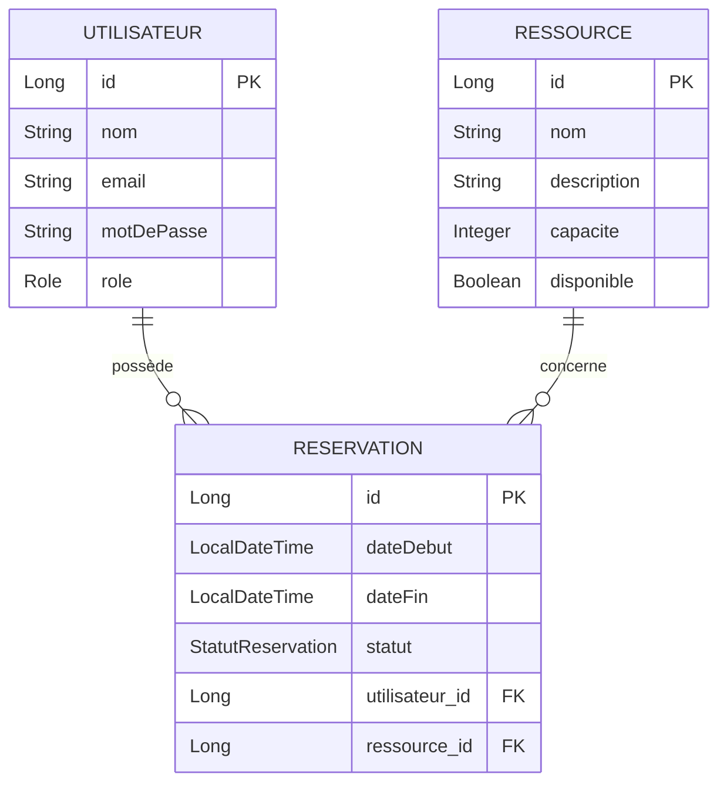

# SlotWise

Système de gestion de réservations de ressources (salles, bureaux, matériel) sur des créneaux horaires, avec authentification JWT, permissions par rôle (`ADMIN`/`USER`), et détection automatique de conflits de créneaux.

Projet réalisé pour apprendre Spring Boot en profondeur — voir [`docs/`](./docs) pour des explications détaillées, fichier par fichier, de chaque brique du projet.

## Stack technique

- **Spring Boot 4** / Spring Framework 7 (Java 21)
- **Spring Data JPA** + **PostgreSQL**
- **Spring Security** + **JWT** (JJWT)
- **Bean Validation** (`@Valid`, `@NotBlank`, `@Positive`...)
- **JUnit 5** + **Mockito** + **AssertJ**
- **Swagger / OpenAPI** (springdoc-openapi)
- **Docker** + **Docker Compose**

## Lancer le projet

Une seule commande (nécessite Docker) :

```bash
docker compose up -d --build
```

L'appli démarre sur `http://localhost:8080`, après que PostgreSQL soit prêt (healthcheck automatique).

- Doc interactive de l'API : `http://localhost:8080/swagger-ui/index.html`
- Spec OpenAPI brute : `http://localhost:8080/v3/api-docs`

## Schéma de la base de données



## Fonctionnalités

### Authentification
- `POST /auth/register` — inscription (rôle `USER` par défaut)
- `POST /auth/login` — connexion, retourne un token JWT

### Ressources (écriture réservée à `ADMIN`)
- `GET /ressources` — lister (tout utilisateur connecté)
- `POST /ressources` — créer (`ADMIN`)
- `PUT /ressources/{id}` — modifier (`ADMIN`)
- `DELETE /ressources/{id}` — supprimer (`ADMIN`)

### Réservations (tout utilisateur connecté)
- `POST /reservations` — créer, avec détection automatique de conflit de créneau
- `GET /reservations/mes-reservations` — lister ses propres réservations
- `DELETE /reservations/{id}` — annuler sa réservation (statut → `ANNULEE`, jamais supprimée)
- `GET /reservations` — vue admin (`ADMIN`), toutes réservations confondues, filtrable par `?ressourceId=`/`?debut=`/`?fin=`

### Règle métier centrale : détection de conflits
Deux créneaux `[debut1, fin1]` et `[debut2, fin2]`, sur la même ressource, sont en conflit si :
```
debut1 < fin2 ET debut2 < fin1
```

## Tests

```bash
./mvnw test
```

Tests unitaires (JUnit + Mockito) sur la logique de conflit de créneaux, isolée via des mocks (pas de vraie base de données nécessaire).

## Architecture

Organisation **package by feature** plutôt que par couche technique :

```
src/main/java/com/izayid/slotwise/
├── auth/            # Authentification (JWT, login, register)
├── utilisateur/     # Entity + repository Utilisateur
├── ressource/       # CRUD Ressource
├── reservation/     # Reservation + détection de conflit
└── config/          # SecurityConfig, OpenApiConfig
```

## Documentation détaillée

Chaque brique du projet est expliquée en détail (code, concepts, pièges rencontrés) dans [`docs/`](./docs) :
- `spring-security-jwt-explique.md` — authentification et sécurité
- `ressource-explique.md` / `reservation-explique.md` — features métier
- `tests-junit-mockito-explique.md` — tests unitaires
- `docker-explique.md` — conteneurisation
- `swagger-openapi-explique.md` — documentation API interactive

Chaque sujet a aussi une version condensée (`*-concepts-cles.md`) listant juste l'essentiel à retenir.
